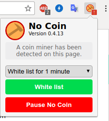
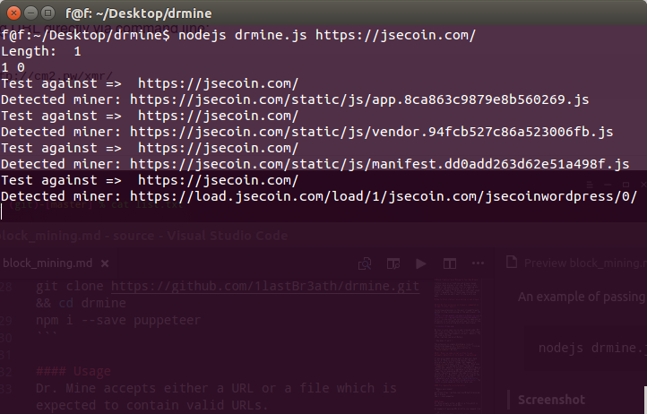

# Block Cryptocurrency Mining In Your Web Browser  

Crytocurrency is a trend now and browser-based cyrtocurrency mining is not new. Mining scripts embbed is the websites you visit is sweating your processor and earning money. So if I want to prevent my computer from mining scripts what shoud I do ? I googled then I found some interesting tools can help me and I want to share with you guys.  

# How to block crytocurrency mining in web browser ?  

## Use No Coin extension on browsers (suppoted on Chrome, Firefox, Safari)  

Installing extensions is the most straightforward method to stop coind mining in the web browser. [No Coin](https://chrome.google.com/webstore/detail/no-coin-block-miners-on-t/gojamcfopckidlocpkbelmpjcgmbgjcl?hl=en)  is one such free solution. This open-source extension is a reliable and safe way to control how a website is interacting with your web browser.  

  

No Coin is also open source and licensed under MIT. Feel free to view the source, fork it, raise issues and submit your improvements via pull requests. You can find on Github:
https://github.com/keraf/NoCoin/  

* How does it work ?  

The extension is simply blocking a liste of blacklisted domains in **blacklist.txt**. Clicking on the icon will display you a button to **pause/unpause** No Coin.  

## Dr. Mine( no node script written to aid automatic detection of in-browser cryptjacking)  

If you are a geek and you want to get your hand dirty. Dr Mine is intersting choice. The most accurate way to detect things that happen in a browser is via browser itself. Thus, Dr. Mine uses **puppeteer** to automate browser thingy and catches any requests to online cryptominers. When a request to any online cryptominers is detected, it flags the corresponding URL and cryptominer being in use. Therefore, however the code is written or obfuscated, Dr. Mine will catch it (as long as the miners are in the list). The list of online cryptominers are fetched from [CoinBlockerLists](https://github.com/ZeroDot1/CoinBlockerLists). The result is also saved on file for later use.  

#### Pre-requisites & Installation  

* Nodejs environment 
```sh  
git clone https://github.com/1lastBr3ath/drmine.git && cd drmine  
npm i --save puppeteer  
```  

#### Usage  
Dr. Mine accepts either a URL or a file which is expected to contain valid URLs.  

An example of passing URL directly via command line;

```sh  
nodejs drmine.js https://jsecoin.com/  
```  

**Screenshot** 
 



# Refereces  

https://fossbytes.com/block-cryptocurrency-mining-in-browser/  