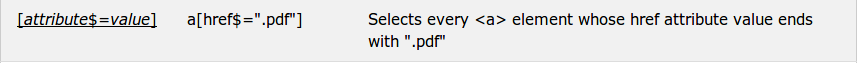
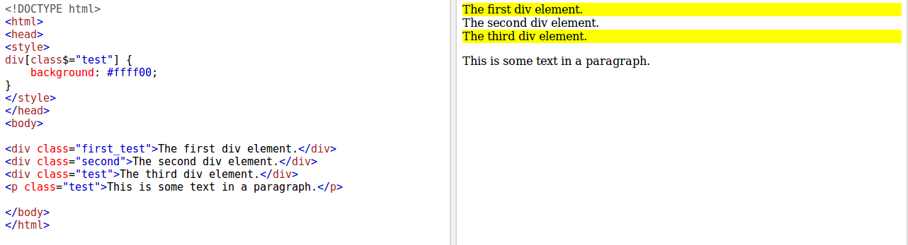
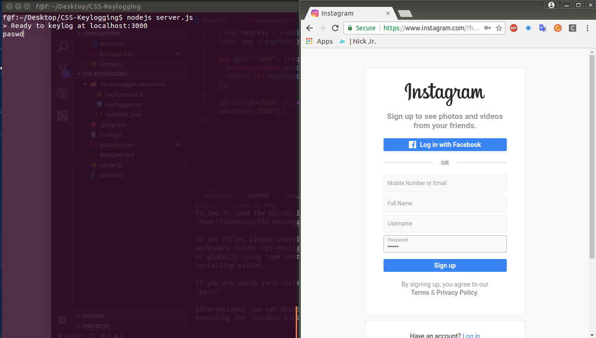

# CSS keylogging

While surfing twitter, I found an intersting video talk about css keylogging. Even it's low impact but it is awesome reseach.I want to try it and write a note about this :).  

# Back to basic  

Follow [w3schools](https://www.w3schools.com/cssref/css_selectors.asp) we have this:

  

Let's try an example:  

We set all of element whose class value is test with background fff00.

**Screenshot**  

  

The question is how about background is a link to third party resource ?  

# Demo  

Let's try an extension [CSS-KeyLogging](https://github.com/maxchehab/CSS-Keylogging)(Chrome extension and Express server that exploits keylogging abilities of CSS). Thank the author for that.  

### Setup Chrome extension  


1. Download repository git clone https://github.com/maxchehab/CSS-Keylogging

2. Visit chrome://extensions in your browser (or open up the Chrome menu by clicking the icon to the far right of the Omnibox: The menu's icon is three horizontal bars. and select Extensions under the More Tools menu to get to the same place).  

3. Ensure that the Developer mode checkbox in the top right-hand corner is checked.  

4. Click Load unpacked extension… to pop up a file-selection dialog.  

5. Select the css-keylogger-extension in the directory which you downloaded this repository.  

### Start express server  

Assuming you have installed nodejs environment.  

```sh  
cd CSS-Keylogging // go to source code  
npm start // start express server  
```  
### Logging password  


1. Open a website that uses a controlled component framework such as React. https://instagram.com.
2. Press the extension C on the top right of any webpage.
3. Type your password.
4. Your password should be captured by the express server.  

**Screenshot**  



# Conclusion  

The real world impact might be low, but it is a mindblowing idea. Anyway it's help us better understanding technology.  

# References  
https://github.com/maxchehab/CSS-Keylogging  
