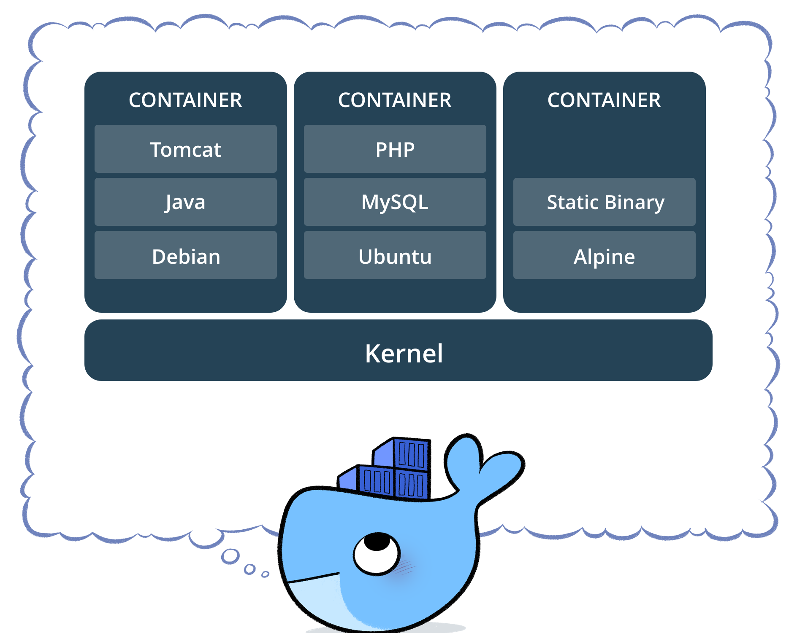

# Kubernetes basic knowledge  

When the first time I use Kubernetes, I was in trouble to understand some kind of new defintions like node, cluster, deployment, etc. In this article will show you some of them.  

  

## Hardware  

### Nodes  

  

A node is the smallest unit of computing hardware in Kubernetes. It is a representation of a single machine in your cluster.  
In most production systems, a node will likely be either a physical machine in a datacenter, or virtual machine hosted on a cloud provider.  

Thinking of a machine as a “node” allows us to insert a layer of abstraction. Now, instead of worrying about the unique characteristics of any individual machine, we can instead simply view each machine as a set of **CPU** and **RAM** resources that can be utilized. In this way, any machine can substitute any other machine in a Kubernetes cluster.  

### The cluster  

Cluster basicly is a pool of nodes. In Kubernetes, nodes pool together their resources to form a more powerful machine. When you deploy programs onto the cluster, it intelligently handles distributing work to the individual nodes for you. If any nodes are added or removed, the cluster will shift around work as necessary. It shouldn’t matter to the program, or the programmer, which individual machines are actually running the code.  

### Persistent Volumes  

  

Because programs running on your cluster aren’t guaranteed to run on a specific node, data can’t be saved to any arbitrary place in the file system. If a program tries to save data to a file for later, but is then relocated onto a new node, the file will no longer be where the program expects it to be.  
To store data permanently, Kubernetes uses Persistent Volumes.  

Persistent Volumes provide a file system that can be mounted to the cluster, without being associated with any particular node.  

## Software  

### Containers  

  

A container image is a lightweight, stand-alone, executable package of a piece of software that includes everything needed to run it: code, runtime, system tools, system libraries, settings.  

### Pods  

  

Unlike other systems you may have used in the past, Kubernetes doesn’t run containers directly; instead it wraps one or more containers into a higher-level structure called a pod. Any containers in the same pod will share the same resources and local network.  
Containers can easily communicate with other containers in the same pod as though they were on the same machine while maintaining a degree of isolation from others.  

Pods are used as the unit of replication in Kubernetes. If your application becomes too popular and a single pod instance can’t carry the load, Kubernetes can be configured to deploy new replicas of your pod to the cluster as necessary.  

Pods can hold multiple containers, but you should limit yourself when possible. Because pods are scaled up and down as a unit, all containers in a pod must scale together, regardless of their individual needs.  

### Deployments  

  

Although pods are the basic unit of computation in Kubernetes, they are not typically directly launched on a cluster. Instead, pods are usually managed by one more layer of abstraction: the deployment.  

A deployment’s primary purpose is to declare how many replicas of a pod should be running at a time. When a deployment is added to the cluster, it will automatically spin up the requested number of pods, and then monitor them. If a pod dies, the deployment will automatically re-create it.  

Using a deployment, you don’t have to deal with pods manually. You can just declare the desired state of the system, and it will be managed for you automatically.  

### Ingress  

  

Using the concepts described above, you can create a cluster of nodes, and launch deployments of pods onto the cluster. There is one last problem to solve, however: allowing external traffic to your application.  

By default, Kubernetes provides isolation between pods and the outside world. If you want to communicate with a service running in a pod, you have to open up a channel for communication. This is referred to as ingress.  

There are multiple ways to add ingress to your cluster. The most common ways are by adding either an Ingress controller, or a LoadBalancer.  
Read more about [ingress](https://kubernetes.io/docs/concepts/services-networking/ingress/)  

### Services  

 

A Kubernetes Service is an abstraction which defines a logical set of Pods and a policy by which to access them - sometimes called a micro-service. The set of Pods targeted by a Service is (usually) determined by a Label Selector (see below for why you might want a Service without a selector).  

## Sources  
https://medium.com/google-cloud/kubernetes-101-pods-nodes-containers-and-clusters-c1509e409e16  

