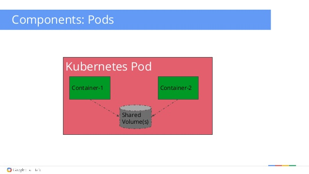
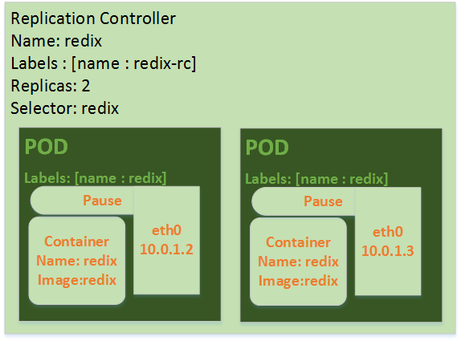
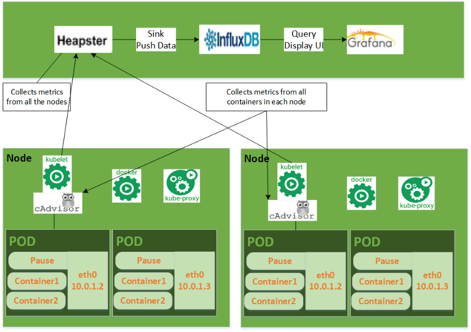
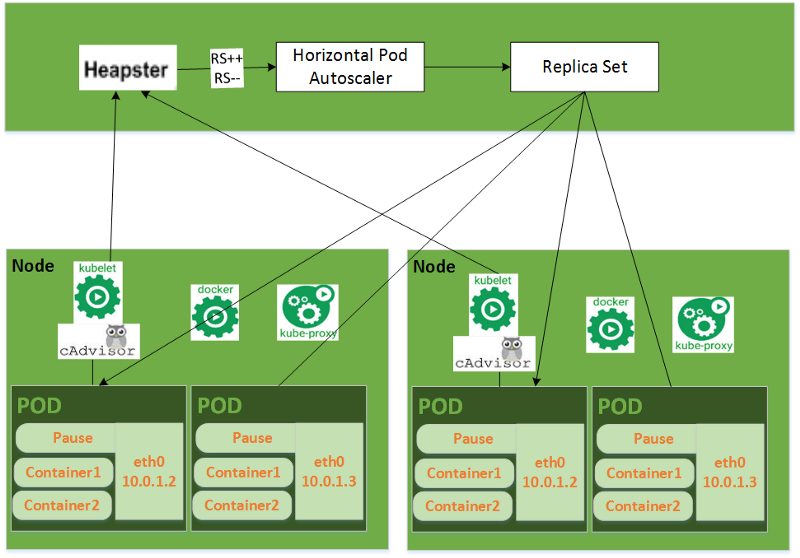
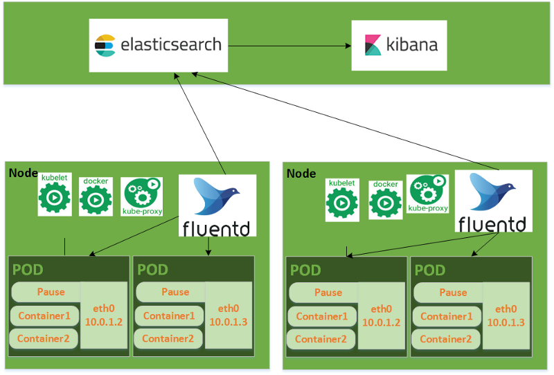

# Kubernetes architecutre  

  

Before we go in kubenetes(aka k8s) architecture, let's start with question 
What is container orchestration ?  

**Container archestration** refers to the automated arrangement, coordination, and management of software containers.  

K8s is a kind of container archestration. It's offers some features:  

* Replication of components  
* Auto-scaling  
* Load balancing  
* Rolling updates  
* Logging across components  
* Service discovery  
* Authentication  

I will go in details with real world examples in the next posts.  

A Kubernetes cluster is made of a master node and a set of worker/slave nodes.  

## Master node

Runs multiple controllers that are responsible for the health of the cluster, replication, scheduling, endpoints(linking Services and Pods), Kubernetes API, interacting with the underlying cloud providers etc.  

Let's dive into each of the components of the master node.  

### API server  

Users use this to interact with the manifest yaml, via Rest operations or kubectl cli. It is employed for every operation related to API Objects, like pod creation, and it is the only component which stores the desired state in etcd.  

### Etcd  

It is a simple, distributed, consistent key-value store. It’s mainly used for shared configuration and service discovery.
It provides a REST API for CRUD operations as well as an interface to register watchers on specific nodes, which enables a reliable way to notify the rest of the cluster about configuration changes.  

An example of data stored by Kubernetes in etcd is jobs being scheduled, created and deployed, pod/service details and state, namespaces and replication information, etc.  

### Scheduler  

Users use this to issue a command to create pod as per manifest yaml to the API Server using kubectl cli. After this action is performed, it is the scheduler’s responsibility to allocate pods to available nodes based on the resource requirement.  


### Controller manager  

The controller manager service is a general service that has many responsibilities. It is responsible for a number of controllers that regulate the state of the cluster and perform routine tasks. For instance, the replication controller ensures that the number of replicas defined for a service matches the number currently deployed on the cluster. The details of these operations are written to etcd, where the controller manager watches for changes through the API server.  

## Worker node  

The pods are run here, so the worker node contains all the necessary services to manage the networking between the containers, communicate with the master node, and assign resources to the containers scheduled.  

### Docker  

 A Docker Daemon is running in each node. If the container image is not present, then it will pull an image from docker registry and run it.  

### Kubelet  

kubelet gets the configuration of a pod from the apiserver and ensures that the described containers are up and running. This is the worker service that’s responsible for communicating with the master node.
It also communicates with etcd, to get information about services and write the details about newly created ones.  

### Kube-proxy  

Kube-proxy acts as a network proxy and a load balancer for a service on a single worker node. It takes care of the network routing for TCP and UDP packets.

# Kubernetes key features  

### Pod- collections of containers  

  

A pod is a deployment unit in the K8S with a single IP address. Inside it, the Pause container handles networking by holding a network’s namespace, port and ip address, which in turn is used by all containers within the pod.  

### Replication Controller  

  

A replication controller ensures that the desired number of containers are up and running at any given time. Pod templates are used to define the container image identifiers, ports, and labels. Using liveness probes, it auto-heals pods and maintains the number of pods as per desired state. It can also be manually controlled by manipulating the replica count using kubectl.  

### Storage Managemenet  

Pods are ephemeral in nature — any information stored in a pod or container will be lost once the pod is killed or rescheduled. In order to avoid data loss, a persistent system — like Amazon Elastic Block Storage (EBS) or Google Compute Engine’s Persistent Disks (GCE PD) — or a distributed file system — such as the Network File System (NFS) or the Gluster File System (GFS) — is needed.  

### Resouce Monitoring  

  

Monitoring is one of the key aspects to run infrastructure successfully. It is the base of hierarchy of reliability. Heapster is an addon used to collect metrics from kubelet, which is integrated with a cAdvisor. cAdvisor is used to collect metrics related to CPU, memory, I/O, and network stats of the running containers. Data collected by Heapster is stored in an influx DB and is displayed in the UI using Grafana. There are also other sinks available like Kafka or Elastic Search, which can be use for storing data and displaying it in the UI.  

### Health Checking  

Health checking in kubernetes is done by a kubelet agent. It is divided into two liveness and readiness probes.

There are mainly three types of handlers:

**ExecAction**: Shell command is executed, and if the resulting exit code is 0, it means that the instance is healthy. Under any other circumstances, the instance is not healthy.

**TCPAction**: Kubelet will try to connect to a specified port, and if it establishes a connection to the given socket, the diagnostic is successful.

**HTTPGetAction**: Based on the HTTP endpoint that the application exposes, kubelet performs an HTTP GET request against the container IP address on a specified path, and if it returns with a 200 to 300 response code, the diagnostic is successful.

Each probe usually has three results:

Success: The Container has passed the diagnostic.
Failure: The Container has failed the diagnostic.
Unknown: The diagnostic has failed, so no action should be taken.  

### Horizontal Auto Scaling  

  

Autoscaling utilizes computational resources based on the load. K8S scale pod automatically uses a HorizontalPodAutoscaler object, which gets metrics data from Heapster, and it decreases or increases the number of pods accordingly. For example, if auto-scaling is based on memory utilization, then the controller starts observing memory usage in the pod and scales the replica count based on it.  

### Service Discovery  

Kubernetes pods are ephemeral, and the Replication Controller creates them dynamically on any node, so it is a challenge to discover services in the cluster. A service needs to discover an IP address and ports dynamically related to each other to communicate within a cluster.

There are two primary ways of finding it — Environment variables and DNS

DNS based service discovery is preferable, and it is available as a cluster add-on. It keeps track of new services in cluster and creates a set of DNS records for each.  

### Networking  

To manage a cluster fully, a network has to be setup properly, and there are three distinct networking problems to solve:
1. **Container-to-Container communications**: pods solve this problem through localhost communications and by using the Pause container network namespace
2. **Pod-to-Pod communications**: this problem is solved by the software defined networking as shown in the Architecture diagram above
 3. **External-to-Pod communications**: this is covered by services.

Kubernetes provides a wide range of networking options. Furthermore, there is now support for the Container Networking Interface (CNI) plugins, which is common plugin architecture for containers. It’s currently supported by several orchestration tools such as Kubernetes, Mesos, and CloudFoundry.  

### Services  

Kubernetes services are abstractions which route traffic to a set of pods to provide a microservice. Kube-proxy runs on each node and manages services by setting up a bunch of iptable rules.

There are three modes of setting up services:
1. **ClusterIP** (only provides access internally)
2. **NodePort** (needed to open firewall on a port; not recommended for public access)
3. **LoadBalancer** (owned by public cloud providers like AWS or GKE)  

### ConfigMap and Secret  

**ConfigMap** makes it possible to inject a configuration based on an environment while keeping the container image identical across multiple environments. These can be injected by mounting volumes or environment variables, and it stores these values in the key/value format.

**Secrets** are used to store sensitive data such as passwords, OAuth tokens, etc.  

### Rolling deployment and rollback  

A Deployment object holds one or more replica sets to support the rollback mechanism. In other words, it creates a new replica set every time the deployment configuration is changed and keeps the previous version in order to have the option of rollback. Only one replica set will be in active state at a certain time.

For rolling deployment, the strategy type required is “RollingUpdate” and “minReadySecs,” which specifies the time that the application takes to serve traffic. It will be unavailable if we leave it on default in the case that the application pods are not ready. This action can be done by running the command below:  
```sh  
$kubectl set image deployment <deploy> <container>=<image> — record
```  
OR  

By replacing content in deployment yaml file and running the command below:

```sh  
$ kubectl replace -f <yaml> — record
```  


If the new version is not behaving as expected, then it is possible to rollback to the previous version by running the below command:
```sh  
$ kubectl rollout undo deployment <deployment>  
```  


If the desired version is any revision other than the previous one, then run:

```sh  
$ kubectl rollout undo deployment <deployment> — to-revision=<revision> 
```  

Note that kubectl rolling-update only supports Replication Controllers. However, if you deploy applications with Replication Controllers, consider switching them to Deployments.  

### Logging  

  

To oversee application behavior, one has to check logs — multiple are generated in each pod. To start searching logs in the Dashboard UI, there has to be some mechanism that collects and aggregates them into one log viewer. To illustrate, Fluentd, an open source tool and part of Cloud Native Computing Foundation (CNCF), combines perfectly with ElasticSearch and Kibana.  

# References  
Kubernetes: Twelve Key Features:
https://medium.com/@abhaydiwan/kubernetes-introduction-and-twelve-key-features-cdfe8a1f2d21  

Introduction to Kubernetes Architecture:
https://x-team.com/blog/introduction-kubernetes-architecture/  

Horizontal Pod Autoscaler Walkthrough: 
https://kubernetes.io/docs/tasks/run-application/horizontal-pod-autoscale-walkthrough/  


